<div align="center">

# CareerPilot AI

### Agentic Career Intelligence for Students and Early-Career Software Engineers

**Turn a resume into explainable job-match insights, prioritized skill gaps, practical career plans, mock-interview feedback, and persistent agentic guidance.**

<br/>


**React · FastAPI · LangChain · LangGraph · Google Gemini · MySQL · ChromaDB · MinIO · Docker · GitHub Actions**

<br/>

[](https://react.dev)
[](https://fastapi.tiangolo.com)
[](https://www.mysql.com)
[](https://www.langchain.com/langgraph)
[](https://ai.google.dev)
[](https://www.docker.com)
[](#testing-and-ci)
[](#testing-and-ci)

<br/>

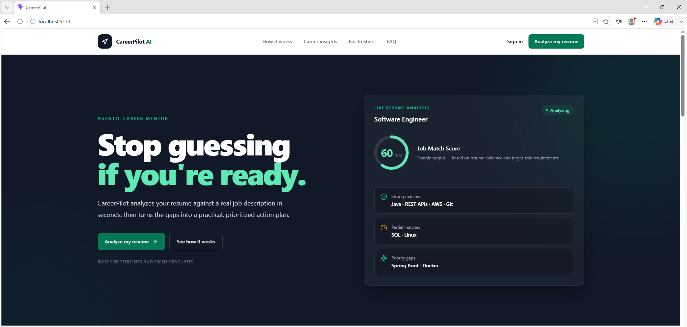

<br/>

[**Live Frontend**](https://careerpilot-ai-umber-beta.vercel.app/) · [**Repository**](https://github.com/SreenithiRamesh/CareerPilot-AI) · [**CI Workflow**](https://github.com/SreenithiRamesh/CareerPilot-AI/actions/workflows/quality-gates.yml)

</div>

> **A note on the current deployment:** The React frontend is continuously hosted on Vercel. The current zero-cost demonstration backend runs in a local Docker Compose environment and is exposed through an HTTPS ngrok tunnel. Backend-powered features are available only while the host machine, Docker services, and tunnel are running. This limitation is documented transparently and does not represent a 24/7 cloud-backend deployment.

<br/>

## Table of Contents

- [About CareerPilot AI](#about-careerpilot-ai)
- [Problem Statement](#problem-statement)
- [Key Capabilities](#key-capabilities)
- [End-to-End Workflow](#end-to-end-workflow)
- [System Architecture](#system-architecture)
- [Resume RAG Architecture](#resume-rag-architecture)
- [Autonomous Agent Workflow](#autonomous-agent-workflow)
- [Storage Responsibilities](#storage-responsibilities)
- [Technology Stack](#technology-stack)
- [Product Showcase](#product-showcase)
- [Repository Structure](#repository-structure)
- [Local Setup with Docker](#local-setup-with-docker)
- [Manual Development Setup](#manual-development-setup)
- [Environment Variables](#environment-variables)
- [Testing and CI](#testing-and-ci)
- [Security Decisions](#security-decisions)
- [Deployment](#deployment)
- [Acceptance Testing](#acceptance-testing)
- [Known Limitations](#known-limitations)
- [Future AWS Architecture](#future-aws-architecture)
- [Roadmap](#roadmap)
- [What This Project Demonstrates](#what-this-project-demonstrates)
- [Author](#author)
- [License](#license)

<br/>

## About CareerPilot AI

**CareerPilot AI** is a full-stack, resume-grounded career-development platform built for students and early-career software engineers. It transforms a user's resume into personalized and actionable career guidance by combining semantic resume retrieval, structured AI analysis, persistent application data, and an autonomous LangGraph workflow.

Users can securely create an account, upload a PDF resume, compare their profile with a job description, identify skill gaps, generate a preparation roadmap, practise mock interviews, and continue multi-turn Career AI conversations across browser sessions.

CareerPilot is designed as a **connected career-intelligence product**, not a collection of isolated AI prompts:

```
Resume → Match → Diagnose → Build Evidence → Plan → Practise → Improve
```

<br/>

## Problem Statement

Students and fresh graduates often receive generic career advice that does not consider the evidence already present in their resumes. They may know a target role but still struggle to answer practical questions:

> - How closely does my resume match this role?
> - Which required skills are demonstrated, partial, or missing?
> - What should I learn first?
> - What project can prove a missing skill?
> - How should I structure the next 30 days?
> - How can I explain my work confidently in an interview?
> - Can my previous analyses and conversations remain available later?

CareerPilot addresses these questions through authenticated, resume-aware, explainable, and persistent workflows.

<br/>

## Key Capabilities

| Feature | Capability |
|---|---|
| **Resume Intelligence** | Validates PDF files, extracts text, creates chunks, generates Gemini embeddings, and indexes evidence in ChromaDB |
| **Job Match** | Compares a selected resume with a target job description and returns an explainable structured report |
| **Skill Gap** | Classifies demonstrated, partial, and missing skills and prioritizes the most important gaps |
| **Build Evidence** | Converts skill gaps into practical exercises, project ideas, and portfolio evidence |
| **Career Plan** | Produces focused preparation priorities and an actionable 30-day roadmap |
| **Career AI** | Provides resume-grounded career guidance with persistent multi-turn conversations |
| **Autonomous Agent** | Plans, selects tools, executes steps, evaluates results, and replans when required |
| **Project Coach** | Helps transform project work into documentation, resume bullets, and interview narratives |
| **Mock Interview** | Generates questions, evaluates answers, provides feedback, and calculates readiness scores |
| **Analysis History** | Persists Job Match, Skill Gap, Career Plan, interview, and conversation records |
| **PDF Export** | Produces a portable career-readiness report from saved analysis |
| **Secure Ownership** | Enforces authenticated and user-scoped access to resumes, objects, analyses, and conversations |

<br/>

## End-to-End Workflow

```mermaid
flowchart LR
    A[Register / Login] --> B[Upload Resume]
    B --> C[Resume RAG Index]
    C --> D[Add Job Description]
    D --> E[Job Match]
    E --> F[Skill Gap]
    F --> G[Build Evidence]
    G --> H[Career Plan]
    H --> I[Career AI]
    I --> J[Project Coach]
    J --> K[Mock Interview]
    K --> L[Analysis History]
    L --> M[PDF Export]
```

CareerPilot is designed as a connected product, not a collection of isolated AI pages. The selected resume becomes reusable context across workflows, while important analysis results are persisted in MySQL for continuity.

<br/>

## System Architecture

### Current zero-cost demonstration

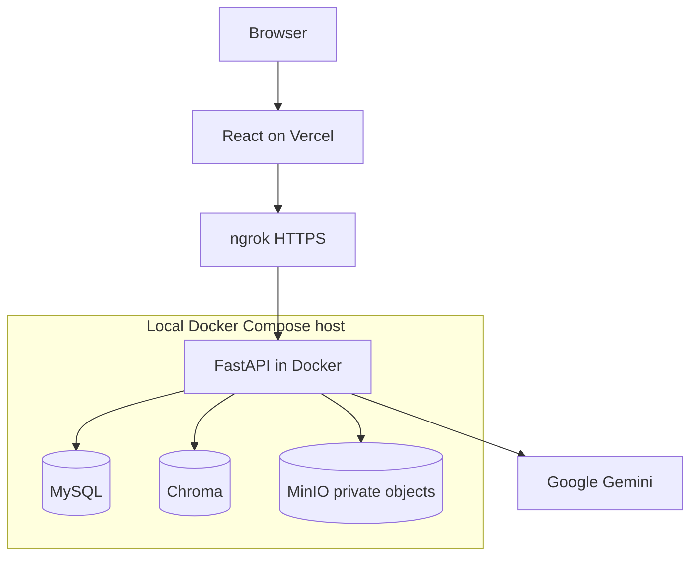

### Application components

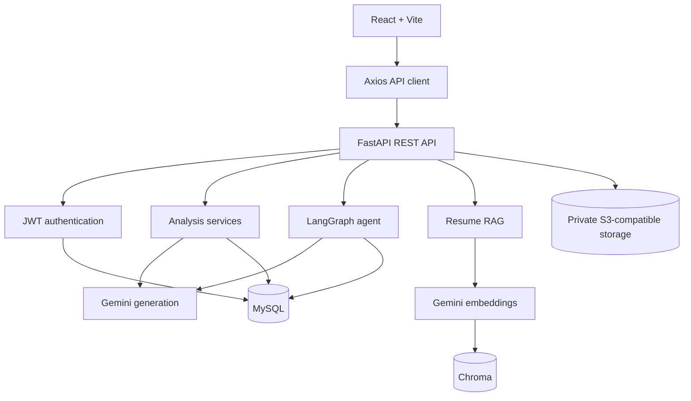

<br/>

## Resume RAG Architecture

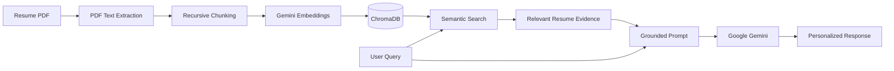

**Why this matters**

CareerPilot does not depend only on generic model knowledge. It retrieves relevant resume chunks and supplies them as context, allowing responses to remain connected to the candidate's actual projects, technologies, certifications, and experience.

Resume vector collections are associated with resume identity, so the same selected resume can support multiple Career AI conversations instead of being locked to a single chat thread.

<br/>

## Autonomous Agent Workflow

CareerPilot includes an autonomous workflow that moves beyond a single chatbot response.

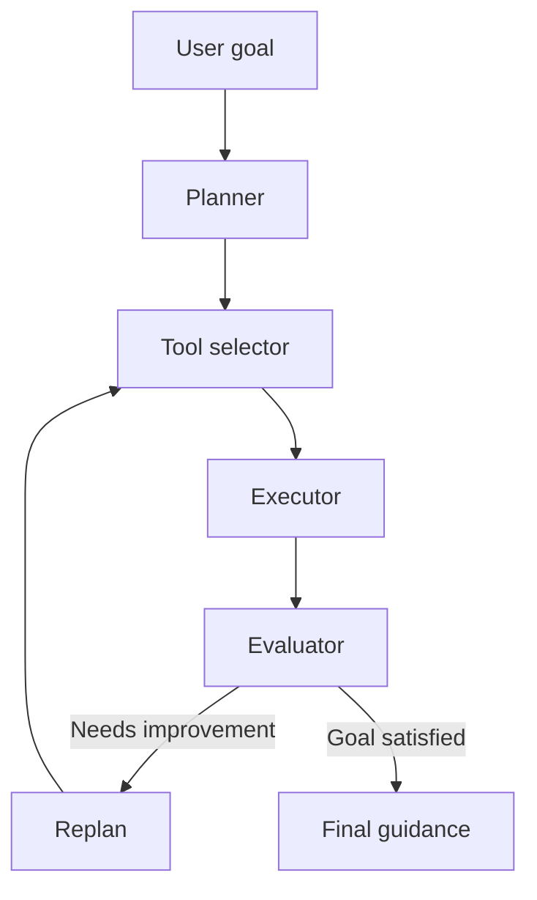

The workflow persists agent runs and steps, reuses the selected resume, and supports follow-up prompts that revise previous plans without losing conversational context.

<br/>

## Storage Responsibilities

| Storage layer | Responsibility | Example data |
|---|---|---|
| **MySQL** | Structured application and workflow state | Users, resume metadata, job descriptions, analysis results, conversations, messages, agent runs, agent steps, interview sessions |
| **ChromaDB** | Semantic resume retrieval | Resume chunks, Gemini embeddings, resume and ownership metadata |
| **MinIO / S3-compatible storage** | Private original documents | Original uploaded PDF at `users/{user_id}/resumes/{resume_id}/original.pdf` |
| **Browser storage** | Lightweight client state | JWT token and selected UI state |
| **Gemini** | External AI inference | Embeddings, structured analysis, interview evaluation, and generated guidance |

The original PDF filename is stored as metadata in MySQL but is intentionally excluded from the object-storage path.

<br/>

## Technology Stack

<div align="center">

**Frontend**


React 19 · Vite · Tailwind CSS · JavaScript · Axios · React Router · Vitest

<br/>

**Backend**


Python 3.12 · FastAPI · Pydantic · SQLAlchemy · Alembic · Uvicorn

<br/>

**Applied AI**

LangChain · LangGraph · Google Gemini · Gemini Embeddings · ChromaDB · Retrieval-Augmented Generation · Structured Outputs

<br/>

**Persistence & Storage**


MySQL 8.4 · ChromaDB · boto3 · Private S3-compatible storage · MinIO (local development)

<br/>

**Infrastructure & Delivery**


Docker · Docker Compose · Persistent Volumes · Health Checks · GitHub Actions · Pytest · ESLint · Vitest

<br/>

**Authentication**

JWT · Secure Password Hashing · Ownership Checks

<br/>

**Demonstration Hosting**

Vercel (frontend) · ngrok HTTPS tunnel (backend)

</div>

<br/>

## Product Showcase

The screenshots below demonstrate the actual CareerPilot workflow from authentication and resume processing through career analysis, AI guidance, interview preparation, and history.

### Authentication and Dashboard

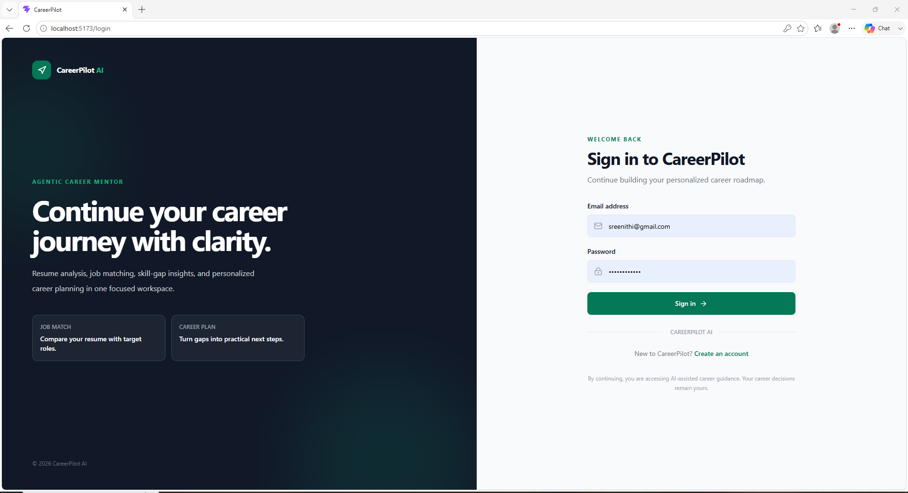
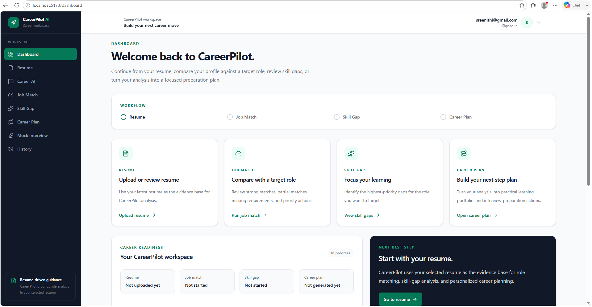

> **Authentication flow:** password hashing → JWT access token → protected frontend routes → authenticated backend endpoints → user-owned data access

### Resume Intelligence

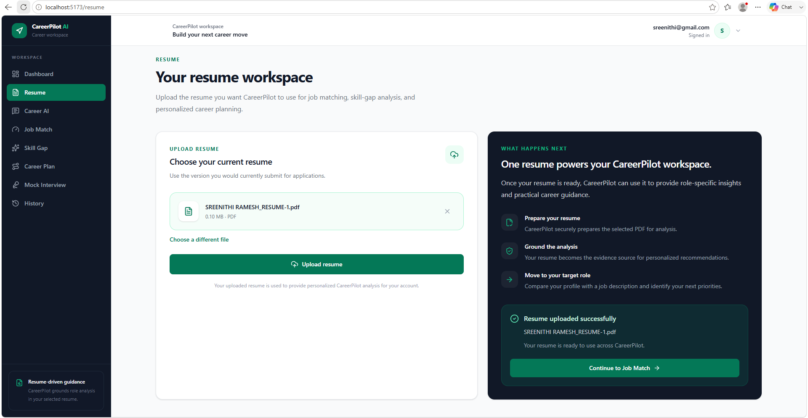

> **Processing pipeline:** PDF validation → text extraction → text chunking → Gemini embeddings → ChromaDB indexing → reusable resume context

### Job Match

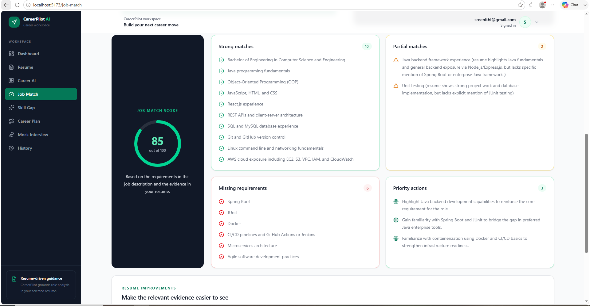

The analysis includes strong matches, partial matches, missing requirements, resume improvements, and priority actions, and is persisted for later review.

### Skill Gap and Evidence Building

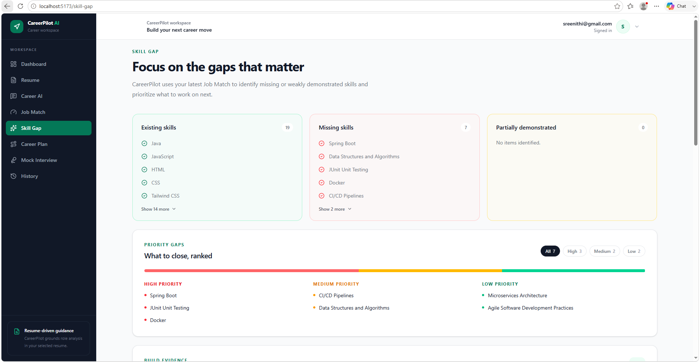
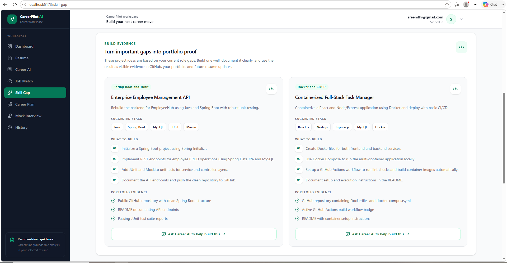

Instead of stopping at a list of missing technologies, CareerPilot recommends practical portfolio evidence that can demonstrate the skill.

### Career Plan

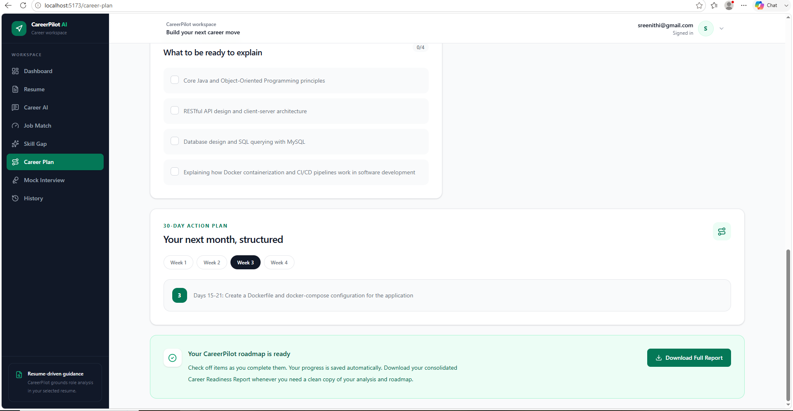

The plan prioritizes important gaps while avoiding unnecessary relearning of technologies already demonstrated by the candidate.

### Career AI and Project Coach

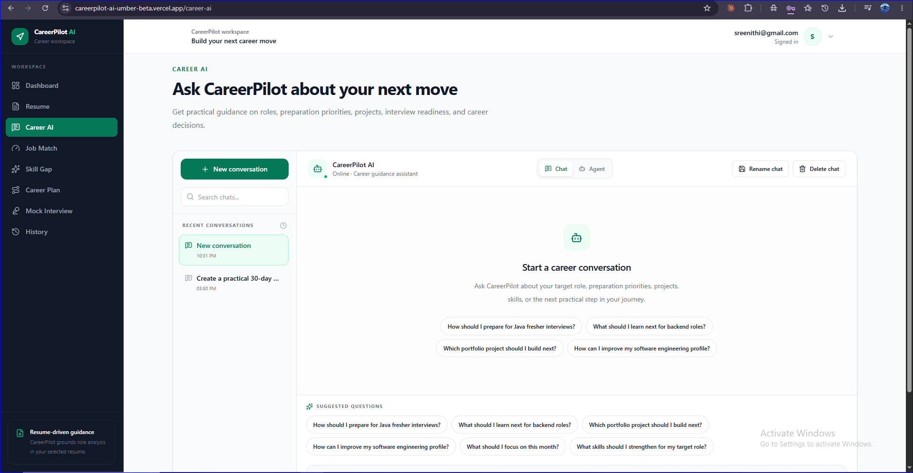
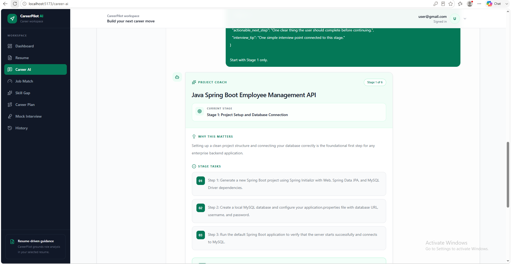

**CareerPilot evidence loop**

```
Identify Skill Gap → Build Project → Document Project → Create Resume Evidence → Prepare Interview Explanation
```

### Mock Interview

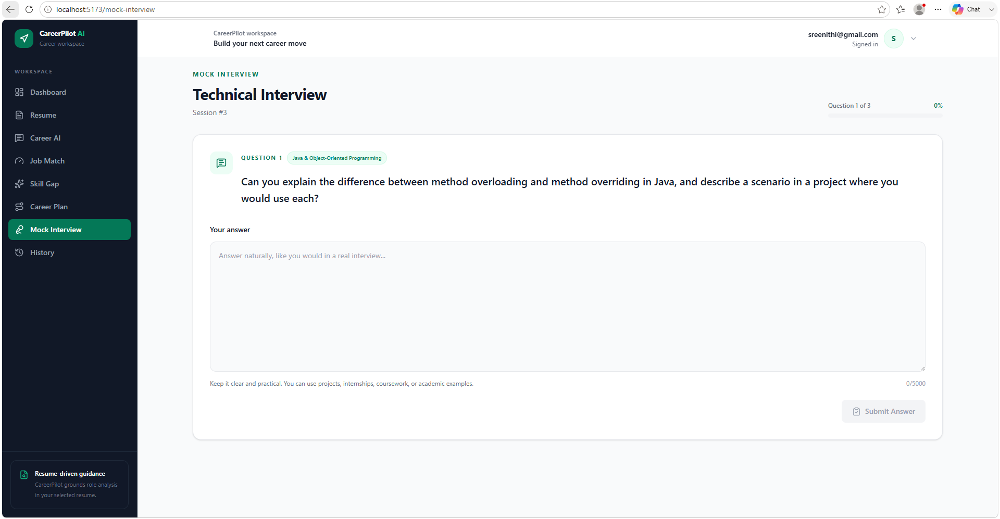
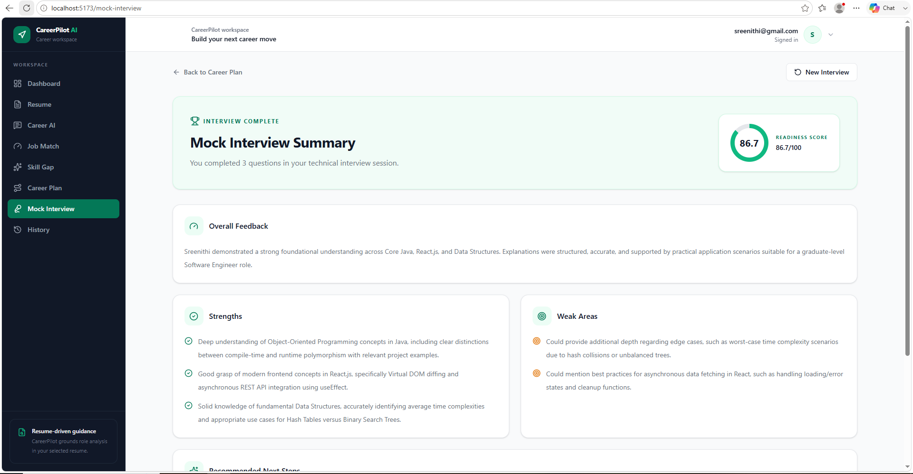

### Analysis History and PDF Report

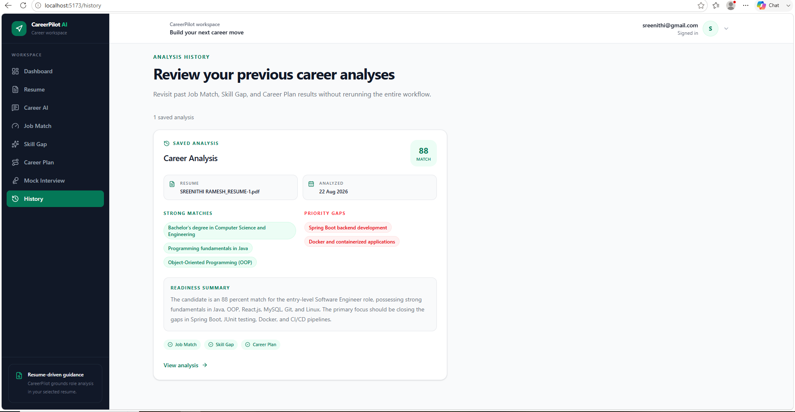
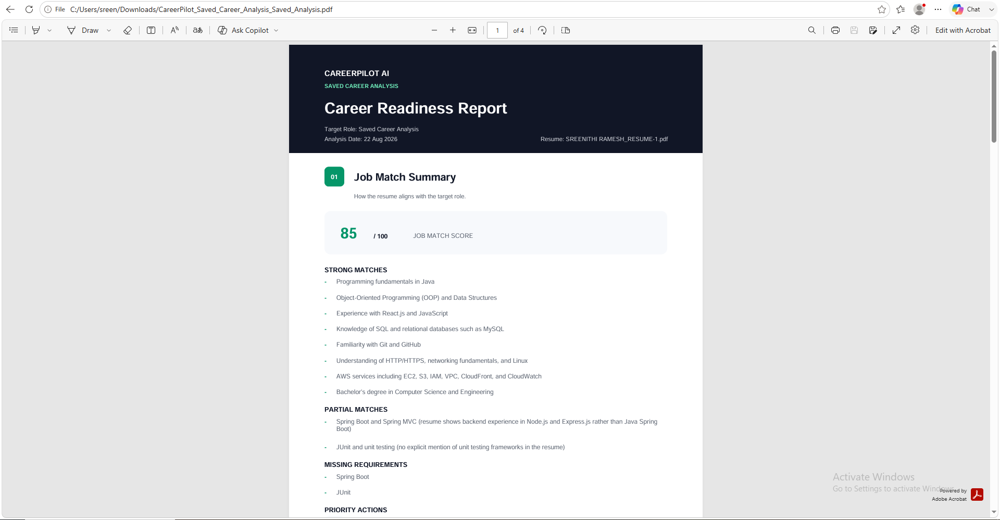

<br/>

## Repository Structure

```
CareerPilot-AI/
├── .github/workflows/          # Automated quality gates
├── backend/
│   ├── alembic/                # Database migrations
│   ├── app/
│   │   ├── auth/               # JWT dependencies and authentication
│   │   ├── career_agent_*.py   # Planner, executor, evaluator, and graph
│   │   ├── models/             # SQLAlchemy models
│   │   ├── schemas/            # Pydantic schemas
│   │   ├── services/           # Persistence, analysis, and storage services
│   │   └── main.py             # FastAPI application
│   ├── tests/                  # Backend unit and integration tests
│   ├── Dockerfile
│   └── requirements.txt
├── deploy/caddy/                # HTTPS reverse-proxy preparation
├── docs/screenshots/            # Portfolio evidence
├── frontend/
│   ├── public/
│   ├── src/
│   │   ├── components/
│   │   ├── pages/
│   │   ├── services/
│   │   └── utils/
│   ├── vercel.json              # SPA route rewrites
│   └── package.json
├── compose.yaml                 # Local Docker development stack
├── compose.production.yaml      # VM-oriented production stack
└── README.md
```

<br/>

## Local Setup with Docker

### Prerequisites

- Git
- Docker Desktop with Docker Compose
- A Google Gemini API key

### 1. Clone the repository

```bash
git clone https://github.com/SreenithiRamesh/CareerPilot-AI.git
cd CareerPilot-AI
```

### 2. Create the Docker environment

```bash
cp .env.docker.example .env.docker
```

On PowerShell:

```powershell
Copy-Item .env.docker.example .env.docker
```

Replace the placeholder values in `.env.docker`. Never commit the real file.

### 3. Validate and start the stack

```bash
docker compose --env-file .env.docker config --quiet
docker compose --env-file .env.docker up --build --detach
docker compose --env-file .env.docker ps --all
```

### 4. Verify the API

```bash
curl http://127.0.0.1:8000/health
```

| Service | Local endpoint |
|---|---|
| FastAPI | `http://127.0.0.1:8000` |
| API documentation | `http://127.0.0.1:8000/docs` |
| MySQL | `127.0.0.1:3307` |
| MinIO API | `http://127.0.0.1:9000` |
| MinIO console | `http://127.0.0.1:9001` |

### 5. Start the frontend

```bash
cd frontend
npm ci
```

Create `frontend/.env.local`:

```env
VITE_API_BASE_URL=http://127.0.0.1:8000
```

Then run:

```bash
npm run dev
```

<br/>

## Manual Development Setup

### Backend

```bash
cd backend
python -m venv .venv
source .venv/bin/activate
python -m pip install --requirement requirements.txt
alembic upgrade head
uvicorn app.main:app --reload
```

For Windows PowerShell, activate the virtual environment with:

```powershell
.venv\Scripts\Activate.ps1
```

### Frontend

```bash
cd frontend
npm ci
npm run dev
```

<br/>

## Environment Variables

Use the committed example files as the source of truth:

- `.env.docker.example`
- `.env.production.example`
- `backend/.env.production.example`
- `frontend/.env.production.example`

| Variable | Purpose | Secret? |
|---|---|---|
| `GEMINI_API_KEY` | Gemini generation and embedding access | Yes |
| `DATABASE_URL` | SQLAlchemy MySQL connection | Yes |
| `LANGGRAPH_DATABASE_URL` | Persistent LangGraph checkpoint connection | Yes |
| `JWT_SECRET_KEY` | JWT signing | Yes |
| `JWT_ALGORITHM` | Token algorithm | No |
| `ACCESS_TOKEN_EXPIRE_MINUTES` | Token lifetime | No |
| `CORS_ORIGINS` | Exact allowed frontend origins | No |
| `AWS_REGION` | S3-compatible client region | No |
| `AWS_ACCESS_KEY_ID` | Storage access identifier | Yes |
| `AWS_SECRET_ACCESS_KEY` | Storage secret | Yes |
| `S3_ENDPOINT_URL` | Optional non-AWS S3 endpoint | Depends on environment |
| `S3_RESUME_BUCKET` | Private resume bucket | No |
| `MINIO_ROOT_USER` | Local MinIO administrator/access key | Yes |
| `MINIO_ROOT_PASSWORD` | Local MinIO secret | Yes |
| `VITE_API_BASE_URL` | Public frontend API endpoint | No |

Production secrets must be created directly in the hosting environment. Do not commit `.env`, `.env.docker`, `.env.production`, tokens, credentials, or exported configuration containing real values.

<br/>

## Testing and CI

### Backend

```bash
cd backend
python -m pip install --requirement requirements-dev.txt
python -m pytest -q
```

Validated result: **65 backend tests passed** ✅

### Frontend

```bash
cd frontend
npm ci
npm run lint
npm test
npm run build
```

Validated result: **39 frontend tests passed**, ESLint passed, and the Vite production build completed successfully. ✅

### GitHub Actions quality gates

The workflow runs on pull requests and pushes to `main` and validates:

- Python 3.12 dependency installation
- MySQL 8.4 service health
- Alembic migration upgrade and schema-drift check
- Backend regression tests
- Frontend deterministic installation
- ESLint
- Vitest
- Vite production build
- Docker Compose configuration
- Dockerfile BuildKit checks
- Backend production-image build

Superseded workflow runs are cancelled through concurrency controls, and repository permissions are read-only.

<br/>

## Security Decisions

- Passwords are securely hashed and never stored in plaintext.
- JWT authentication protects personalized endpoints.
- Database queries and object operations are scoped to the authenticated user.
- Resume PDFs are stored in a private bucket with anonymous access disabled.
- Object keys use ownership-scoped paths and do not expose original filenames.
- Failed resume indexing triggers best-effort object cleanup.
- CORS uses explicit allowed origins instead of unrestricted production access.
- Secrets remain environment-based and excluded from Git.
- The backend emits structured logs and request identifiers without intentionally logging credentials.
- Containers use health checks, and the backend image runs as a non-root user.
- Production infrastructure services are not directly exposed by `compose.production.yaml`; Caddy is the public gateway.

<br/>

## Deployment

### Current demonstration deployment

| Component | Deployment |
|---|---|
| Frontend | Vercel Hobby |
| Public backend endpoint | ngrok Free HTTPS tunnel |
| FastAPI, MySQL, MinIO, Chroma | Local Docker Compose host |
| Persistence | Docker volumes for MySQL, MinIO, and Chroma |
| CI | GitHub Actions |

Frontend environment:

```env
VITE_API_BASE_URL=https://your-public-api.example
```

Backend CORS:

```env
CORS_ORIGINS=https://your-frontend.example
```

### VM deployment preparation

The repository includes:

- `compose.production.yaml`
- Production-safe environment templates
- Persistent volumes
- Caddy reverse-proxy configuration
- Backend health checks
- Private internal MySQL and MinIO services
- HTTPS and domain placeholders
- Production frontend API validation

Only deploy this stack when the selected provider clearly identifies the VM and attached storage as free, or when an approved budget exists.

<br/>

## Acceptance Testing

The public demonstration was validated through the following flows:

- Vercel frontend loading and SPA deep-link refresh
- Registration, sign-in, sign-out, and authentication persistence
- CORS preflight from the production frontend origin
- PDF resume upload and restored original filename
- Ownership-scoped object-key persistence in MySQL
- Private object existence in MinIO
- Chroma resume collection persistence
- Job Match, Skill Gap, Career Plan, and Mock Interview workflows
- Autonomous Agent planning and follow-up memory
- Conversation restoration after refresh
- Data restoration after backend-container restart
- Remote-user access through the public HTTPS tunnel
- Backend log and health inspection

Transient Gemini demand responses and ngrok connection interruptions were observed during testing. The backend remained healthy, retried supported failures, and persisted completed responses where applicable.

<br/>

## Known Limitations

- The current backend runs as a zero-cost demonstration (local Docker Compose + ngrok) rather than an always-on cloud VM; a migration path to AWS is documented below.
- AI-generated career guidance is meant to support the user's own judgment, not replace it, and is not a hiring guarantee.

<br/>

## Future AWS Architecture

> AWS is a target architecture and has not been claimed as the current live deployment.

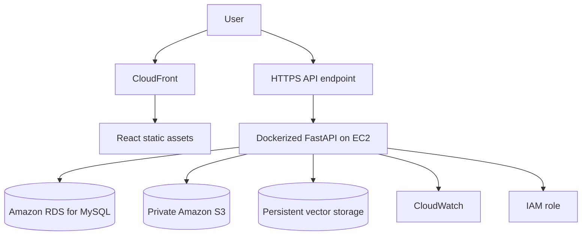

Planned migration principles:

- Use an EC2 IAM role rather than static AWS credentials.
- Store original PDFs in a private S3 bucket.
- Serve the React frontend through S3 and CloudFront.
- Use RDS for MySQL when the budget supports managed persistence.
- Centralize logs and operational visibility in CloudWatch.
- Preserve the separation between relational data, vectors, and original documents.

<br/>

## What This Project Demonstrates

CareerPilot AI demonstrates practical experience across:

**Full-Stack Development · REST APIs · Authentication · SQL Persistence · Vector Search · RAG · LLM Integration · LangGraph · Structured AI Workflows · State Management · Containerization · CI/CD · Testing · Applied AI Product Engineering**

> The objective is not to build another chatbot interface, but to build a persistent, explainable, resume-grounded career intelligence system.

<br/>

## Author

<div align="center">

### Sreenithi Ramesh

**Computer Science and Engineering Graduate — 2026**

Software Engineering · Full-Stack Development · Cloud · Applied AI

GitHub

**CareerPilot AI — From resume to roadmap.**

</div>

<br/>

## License

This repository currently serves as an educational and portfolio project. Add an explicit LICENSE file before allowing reuse or redistribution.
